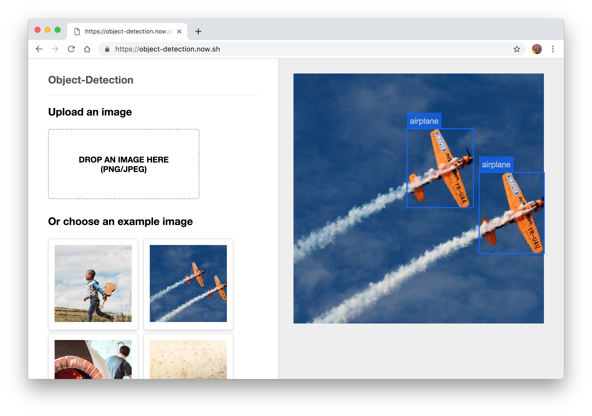

# object-detection

An API and an app to detect objects on images.

**Deploy on Vercel:**

[](https://vercel.com/new/project?template=lucleray/object-detection)

### 👉 [Demo here](https://object-detection.vercel.app)



If you want to read more about how this was made, [read the detailed article about it on Vercel's blog](https://zeit.co/blog/serverless-machine-learning).

The repository contains two folders:

- `/api`, the code of the API taking care of detecting objects on images, powered by Tensorflow
- `/app`, the code of the frontend website, powered by Next.js


## Development

Running the API locally:

```
yarn --cwd api run dev
```

Running the app locally:

```
yarn --cwd app run dev
```
